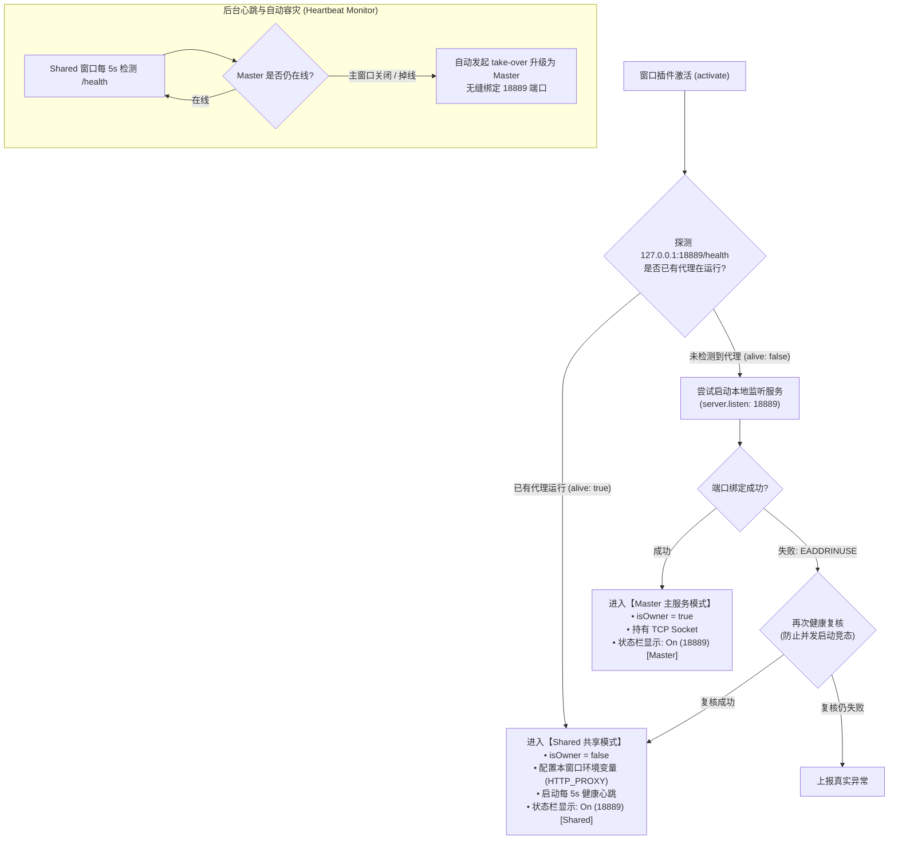

# HTTP AI Plugin Proxy Gateway 多窗口端口冲突问题与架构解决方案

> **文档版本**：v1.1.0  
> **适用组件**：`http-ai-plugin-proxy` VS Code 扩展  
> **更新时间**：2026-08-24  
> **状态**：已解决 (Resolved)

---

## 1. 问题背景与现象 (Problem Description)

在使用 `HTTP AI Plugin Proxy Gateway` 插件时，当开发者在 VS Code 中**打开第二个或多个工作区窗口（New Window / Open Folder in New Window）**时，后开启的窗口会出现以下异常现象：

1. **状态栏报错**：右下角状态栏亮起红色警报，显示 `$(warning) AI 代理: 异常`；
2. **核心报错日志**：输出通道中报错：
   ```text
   [Failure] Could not start proxy: listen EADDRINUSE: address already in use 127.0.0.1:18889
   ```
3. **终端与环境失效**：新窗口的集成终端无法自动注入 `HTTP_PROXY` / `HTTPS_PROXY` 环境变量；
4. **连锁反应（互相干扰）**：若在任一从属窗口中关闭 VS Code，其插件卸载钩子（`deactivate`）可能会将全局代理配置 `http.proxy` 清空，导致先开启的主窗口代理意外中断。

---

## 2. 根因深度剖析 (Root Cause Analysis)

### 2.1 VS Code 独立 Extension Host 机制

VS Code 为每一个打开的顶级窗口（Window）分配一个独立的 **Extension Host（Node.js 插件宿主进程）**：

```text
+-------------------------------------------------------------+
|                     VS Code Main Process                    |
+-------------------------------------------------------------+
               |                               |
               v                               v
+-------------------------------+ +-------------------------------+
| Window 1: Extension Host (PID) | | Window 2: Extension Host (PID) |
| -> runs activate()            | | -> runs activate()            |
| -> proxy.start()              | | -> proxy.start()              |
| -> binds 127.0.0.1:18889 (OK) | | -> binds 127.0.0.1:18889 (FAIL|
+-------------------------------+ +-------------------------------+
```

* **端口排他性**：TCP 监听端口在操作系统层面是独占的。Window 1 成功绑定了 `18889`，Window 2 执行 `http.createServer().listen(18889)` 必将触发操作系统的 `EADDRINUSE` 错误；
* **单例视角缺陷**：原有插件逻辑假设自身是全局唯一的服务持有者，未区分“服务提供方（Master/Server）”与“服务消费方（Client/Shared）”；
* **析构无差别清理**：`deactivate()` 逻辑无条件执行 `stopProxy()`，清除了 VS Code 全局 `http.proxy` 设置。

---

## 3. 架构重构方案：Master-Shared Failover 模式

为彻底解决多窗口冲突，我们重构了插件架构，引入了 **Master-Shared 动态协商与自动容灾接管机制**：



---

## 4. 核心改造点与技术实现细节

### 4.1 端口预检与健康探测 (`checkProxyHealth`)
利用自带的 `/_health` 或 `/health` 端点（返回 HTTP 200 与网关元数据），在每次启动前先进行毫秒级探测：

```javascript
function checkProxyHealth(port, host = '127.0.0.1', timeoutMs = 1500) {
  return new Promise((resolve) => {
    const req = http.get(`http://${host}:${port}/health`, { timeout: timeoutMs }, (res) => {
      let data = '';
      res.on('data', (chunk) => { data += chunk; });
      res.on('end', () => {
        if (res.statusCode === 200) {
          resolve({ alive: true, data: JSON.parse(data) });
        } else {
          resolve({ alive: false, error: `HTTP ${res.statusCode}` });
        }
      });
    });
    req.on('error', (err) => resolve({ alive: false, error: err.message, code: err.code }));
    req.on('timeout', () => { req.destroy(); resolve({ alive: false, error: 'timeout' }); });
  });
}
```

### 4.2 双态管理（Master vs Shared）
* **`isOwner = true`（Master 实例）**：实际持有 Node.js HTTP/TLS 转发 Server，负责网络数据流中继；
* **`isOwner = false`（Shared 实例）**：作为轻量客户端附着到已有端口，只负责本窗口的 Terminal 环境变量注入与状态栏呈现。

### 4.3 生命周期与析构保护 (`deactivate` & `stopProxy`)
在非主窗口关闭时，不触碰全局代理配置，避免误伤其他窗口：

```javascript
async function stopProxy(showNotification = false, forceStop = false) {
  stopHeartbeat();

  if (isOwner || forceStop) {
    if (proxyServer) {
      await proxyServer.stop();
      proxyServer = null;
    }
    isOwner = false;
    // 仅在 Master 主动关闭时清理全局配置
    if (extConfig.autoConfigureVsCode) {
      await configureVsCodeProxy(false, extConfig.localPort);
    }
  } else {
    // Shared 模式仅脱离本窗口环境，不停止公共网关
    clearEnvProxy();
    configureTerminalEnv(extensionContext, false, getExtensionConfig().localPort);
  }
}
```

### 4.4 自动容灾晋升机制（Auto-Failover Heartbeat）
Shared 窗口每 5 秒自动检测一次。如果用户关闭了最先启动的 Master VS Code 窗口，剩余的窗口会检测到连接断开，并**自动无缝接管端口晋升为 Master**，整个过程无需人工介入。

### 4.5 诊断测试兼容
在 Shared 模式下，`testConnectionCommand` 依然能够正常加载 `deployment.local.json` 上游凭据，直接测试与 Google Cloud Code、Gemini、OpenAI、GitHub 等 API 的直连连通性与时延。

---

## 5. 验证与测试结果

| 测试场景 | 预期表现 | 实际结果 |
|---|---|---|
| **单窗口启动** | 成功绑定 18889，成为 Master | ✅ 正常，状态栏 On (18889) |
| **开第 2 个 VS Code 窗口** | 自动识别已有代理，进入 Shared 模式，无报错 | ✅ 正常，状态栏 On (18889) [Shared] |
| **开第 3/4 个 VS Code 窗口** | 均自动进入 Shared 模式 | ✅ 正常，全部无缝复用 |
| **关闭从属窗口** | Master 与其他从属窗口保持代理通畅，不受影响 | ✅ 正常，无全局断连 |
| **关闭 Master 窗口** | 从属窗口在 5s 内自动接管端口，晋升为 Master | ✅ 正常，自动容灾成功 |
| **连通性测试命令** | 在任何窗口点击测试均能输出完整的 7 个目标端点时延 | ✅ 正常，全绿通过 |

---

## 6. 文件更新清单

本次修复涉及的文件同步更新如下：
* 源码文件：`vscode_env/http-ai-plugin-proxy/src/extension.js`
* 插件安装副本：`~/.vscode/extensions/local.http-ai-plugin-proxy-1.0.0/src/extension.js`
* 文档沉淀：`vscode_env/http-ai-plugin-proxy/MULTI_WINDOW_FIX.md`

